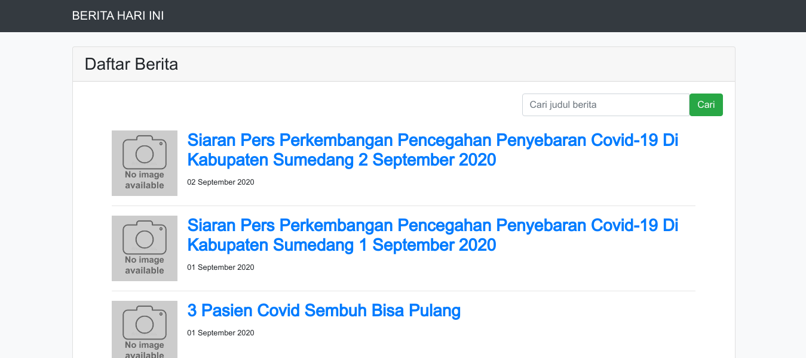
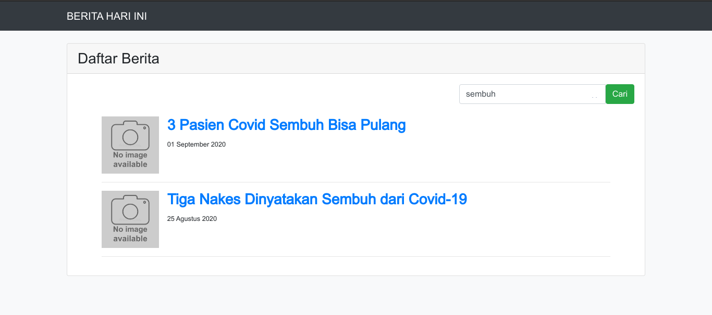
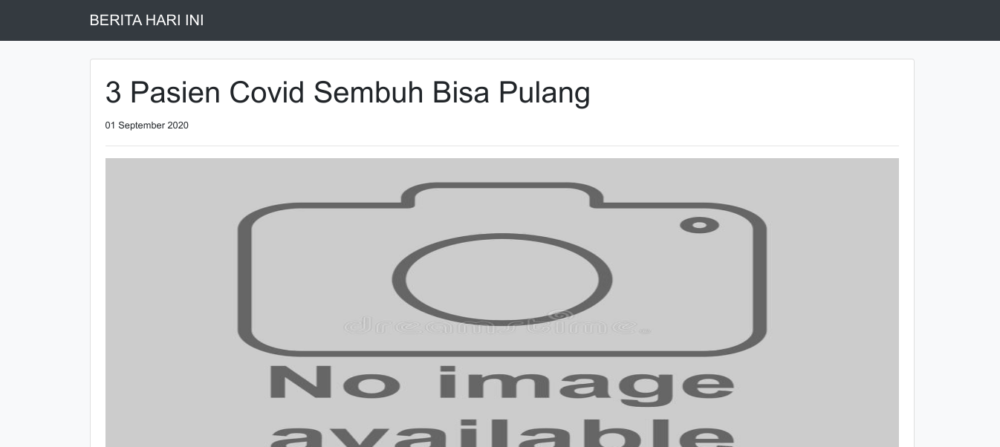

# Test API Berita

# Screenshot

1. Tampilan Depan

2. Tampilan Filtering/Pencarian

3. Tampilan Detail Berita 

# Route

- `localhost::8000` : Untuk menampilkan halaman awal
- `localhost::8000/berita/{slug}` : Untuk menampilkan data berdasarkan slug judul